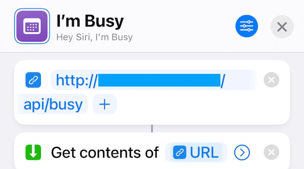
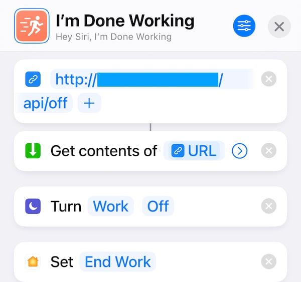

# UnicornMini free-busy server

## Assumptions

* A Raspiberry Pi Zero W
* The user `pi` is present; if not, update [freebusy.service](freebusy.service)
* Running Raspbian OS Buster
* [A Unicorn HAT Mini](https://shop.pimoroni.com/products/unicorn-hat-mini)

## Setup

Run `install.sh` to install project dependencies and prepare for use. This script will install the require python modules, will also install a systemd service to enable the free-busy server on boot.

If you wish, you can stop `freebusy.service` and run `python3 test.py` to validate that the HAT is working correctly.

## Usage

Assuming the service started at boot, you can hit several endpoints:

```bash
http://{your Pi IP}/api/status
# print a JSON blob with the current state of your PI; for example:
# {"brightness":0.1,"cpuTemp":104.4356,"height":7,"status":"off","width":17}

http://{your Pi IP}/api/busy
# Set the 'busy' state and turn the HAT red

http://{your Pi IP}/api/free
# Set the 'free' state and turn the HAT green

http://{your Pi IP}/api/away
# Set the 'away' state and turn the HAT yellow

http://{your Pi IP}/api/off
# turn the HAT off
```

## Automation

Anything on your local subnet can hit this API endpoint, which means your phone can trigger different states; I've found Shortcuts in iOS to be very adept at this sort of daily automation, especially when combined with Focus modes in iOS 15. Since iOS shortcuts are exposed to Siri, you can trigger state change by voice as well.

Set the busy state.



Have a drink, you've worked hard.



## Acknowledgements

[Unicorn HAT Mini Library](https://github.com/pimoroni/unicornhatmini-python)

[I stole a lot of code from this project.](https://www.eliostruyf.com/diy-building-busy-light-show-microsoft-teams-presence/)
